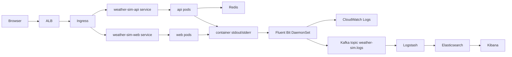
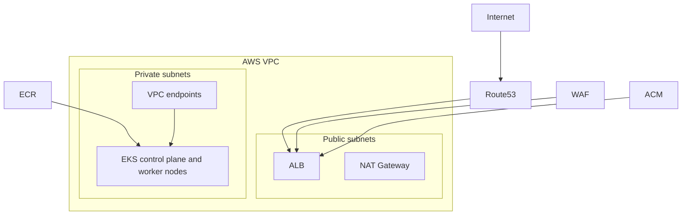
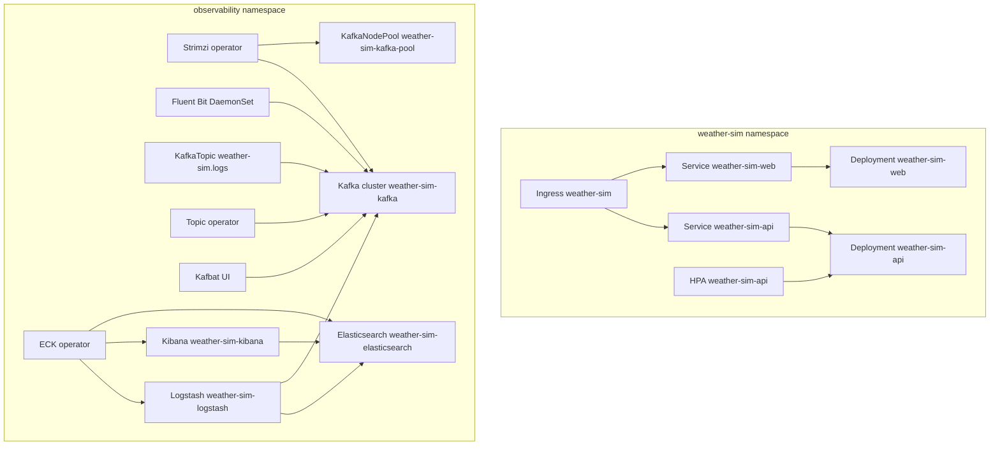

# Architecture

## Runtime Flow

## AWS Infrastructure Context

## Kubernetes Namespace Layout

## Kubernetes Pod Layout

### Application Namespace: `weather-sim`
- `weather-sim-api` is a Deployment with `replicaCount: 2` by default.
- `weather-sim-api` exposes container port `8080`.
- `weather-sim-api` has liveness and readiness probes on `/api/v1/system/live` and `/api/v1/system/ready`.
- `weather-sim-api` is fronted by the `weather-sim-api` ClusterIP Service on port `8080`.
- `weather-sim-api` has a HorizontalPodAutoscaler with `minReplicas: 2` and `maxReplicas: 5`, targeting average CPU utilization of `70%`.
- `weather-sim-web` is a Deployment with `replicaCount: 2` by default.
- `weather-sim-web` exposes container port `80`.
- `weather-sim-web` is fronted by the `weather-sim-web` ClusterIP Service on port `80`.
- The shared Ingress named `weather-sim` routes `/` to `weather-sim-web` and `/api` to `weather-sim-api`.

### Observability Namespace: `observability`
- Strimzi deploys and manages the Kafka control plane resources.
- `weather-sim-kafka-pool` is a KafkaNodePool with `replicas: 1`.
- That single Kafka node carries both `controller` and `broker` roles for this POC.
- Kafka is exposed internally on port `9092` through the Strimzi bootstrap service.
- The Kafka topic `weather-sim.logs` is managed as a Strimzi `KafkaTopic`.
- Kafbat UI runs as an internal-only web UI for inspecting the Kafka cluster and topics.
- Fluent Bit runs as a DaemonSet, so expected pod count is one Fluent Bit pod per Kubernetes node.
- ECK manages Elasticsearch, Kibana, and Logstash custom resources.
- Elasticsearch is configured as a single-node cluster with `count: 1`.
- Kibana is configured with `count: 1`.
- Logstash is configured with `count: 1`.

## Pod Placement and Scaling Notes
- The application baseline pod footprint is four pods before HPA scale-out: two API pods and two web pods.
- API pod count can scale above two when CPU utilization crosses the HPA threshold.
- Fluent Bit pod count scales with node count, not request traffic, because it is a DaemonSet.
- Kafka is not horizontally scaled in this POC; there is one broker/controller pod.
- Elasticsearch, Kibana, and Logstash are each single-instance in this POC.
- Elasticsearch uses preferred pod anti-affinity by hostname, which matters more if node count increases later.
- Kafka, Elasticsearch, and Logstash use persistent volumes where configured; Fluent Bit stores local tail-state on the node host path.

## Traffic and Log Routing Details
- External browser traffic reaches AWS through an Application Load Balancer and then the Kubernetes Ingress.
- `/` routes to the web service and `/api` routes to the API service.
- API and web containers write structured and unstructured logs to container stdout/stderr.
- Fluent Bit tails `/var/log/containers/*.log`, enriches records with Kubernetes metadata, and filters to the `weather-sim` namespace.
- Fluent Bit publishes those records into Kafka topic `weather-sim.logs`.
- Fluent Bit also writes the same records into CloudWatch Logs group `/${cluster_name}/observability/application`, which resolves to `/weather-sim-poc/observability/application` in the default POC environment.
- Logstash consumes from Kafka, drops records outside the application namespace when needed, and writes to Elasticsearch index `weather-sim-logs-%{+YYYY.MM.dd}` locally and `${project_name}-logs-%{+YYYY.MM.dd}` in EKS.
- Kibana reads Elasticsearch indices and is the primary UI for API log inspection.
- Kafka UI is the fastest point to confirm that logs are reaching Kafka before Elasticsearch indexing is involved.
- CloudWatch Logs is the AWS-native path to confirm Fluent Bit is exporting records even if the Kafka or Elastic path is degraded.

## Storage and Retention
- Kafka uses a persistent volume in the KafkaNodePool and retains logs for `72` hours in this POC.
- Elasticsearch uses a persistent volume and is configured here with a single node and `20Gi` storage in the Terraform defaults.
- Logstash uses a `2Gi` persistent volume claim in the ECK stack values.
- Logstash persistent queue mode is disabled and uses `queue.type: memory` to keep the POC simple.

## Internal-Only Services
- Kafka, Elasticsearch, Kibana, and Kafbat UI are internal-only in EKS.
- Those services are intended to be accessed with `kubectl port-forward`, not public ingress.
- The public ingress path is limited to the application web and API services.

## Named Resources
- Kafka cluster: `weather-sim-kafka`
- Kafka node pool: `weather-sim-kafka-pool`
- Kafka topic: `weather-sim.logs`
- CloudWatch Logs group: `/weather-sim-poc/observability/application`
- Kafka UI release: `kafbat-ui`
- Fluent Bit release: `fluent-bit`
- ECK operator release: `eck-operator`
- ECK stack release: `eck-stack`
- Elasticsearch resource: `weather-sim-elasticsearch`
- Kibana resource: `weather-sim-kibana`
- Logstash resource: `weather-sim-logstash`
- Application ingress: `weather-sim`
- Application services: `weather-sim-api`, `weather-sim-web`

## Key Design Points
- The application release stays in `weather-sim` and only owns the API and web workloads.
- The observability release set lives in `observability`.
- Kafka is managed by Strimzi as a single-broker KRaft POC topology.
- Fluent Bit runs as a DaemonSet so it can tail node-level container logs and enrich them with Kubernetes metadata.
- Kibana is the primary log viewing entry point, Kafka UI is the fastest place to inspect raw log transport through Kafka, and CloudWatch Logs provides a parallel AWS-native copy of the application stream.
- The AWS edge path is Route53 -> ACM/WAF -> ALB -> Kubernetes Ingress -> in-cluster services.
- The repository still does not provision Redis for EKS, even though the app expects it for sessions.

## Important AWS Constraint
- An Application Load Balancer cannot be assigned an Elastic IP directly. If static public IPs are needed later, use AWS Global Accelerator or redesign the ingress path.
