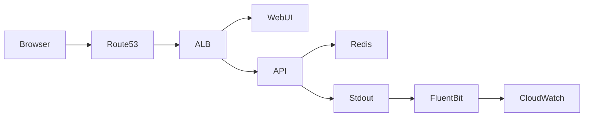
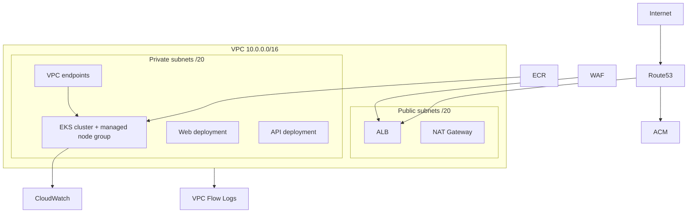

# Architecture

## Runtime architecture

## Infrastructure architecture

## Key design points
- The AWS application stack is deployed with Terraform and Helm.
- The VPC uses a `/16` CIDR and is split across two Availability Zones.
- Two public `/20` subnets are reserved for internet-facing load balancers and egress infrastructure.
- Two private `/20` subnets are reserved for EKS worker nodes and in-cluster workloads.
- The EKS API endpoint is private-only, so cluster administration and Terraform runners must reach it from a VPC-connected network path.
- Private workloads use VPC endpoints for core AWS services instead of relying on broad security-group egress to the internet.
- The ALB is created by the AWS Load Balancer Controller from the Kubernetes ingress.
- WAFv2 is attached to the ALB through ingress annotations.
- ACM provides the TLS certificate for the ALB listener.
- Route53 publishes the application DNS name.
- Application logs are intended to flow into CloudWatch under `/weather-sim-poc/poc/app`.
- VPC flow logs are enabled for the application VPC and shipped to CloudWatch.
- The application still depends on Redis for session storage, but this repository does not currently provision Redis for the EKS environment.

## Application behavior
- The React frontend calls the Express API under `/api/v1`.
- `helmet`, CORS, rate limiting, session middleware, and structured request logging run globally in the API.
- The WebUI uses the authenticated session cookie for weather requests and does not bundle an API key.
- `GET /weather/current` requires either a valid session or a valid `x-api-key`.
- `GET /weather/premium-forecast` requires either a `premium` or `admin` session, or a `premium`/`admin` `x-api-key`.

## Important AWS constraint
- An Application Load Balancer cannot be assigned an Elastic IP directly. If static public IPs are required later, use AWS Global Accelerator or redesign around an NLB-based entry pattern.
