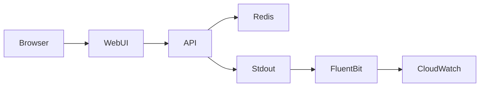

# Architecture

- Frontend React app authenticates against backend session endpoints.
- API enforces session + API key + RBAC for weather routes.
- Fluent Bit sidecar forwards logs to CloudWatch `/weather-sim/poc/app`.
