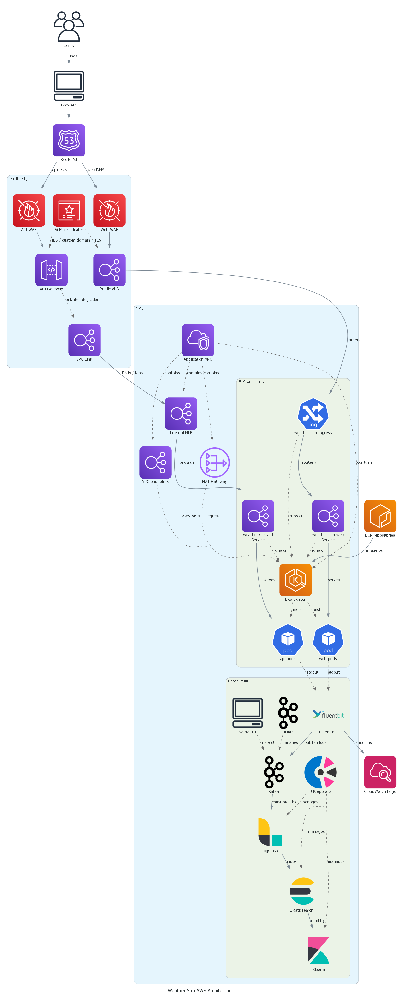
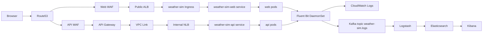

# Architecture

## Edge Routing
The deployment now uses two separate internet edges:
- Web UI: Route53 -> public ALB -> Kubernetes Ingress -> `weather-sim-web`
- API: Route53 -> WAF -> API Gateway -> VPC Link -> internal NLB -> `weather-sim-api`

The shared ALB ingress no longer publishes `/api` directly. API traffic stays behind API Gateway and its WAF layer, while the browser-facing web app keeps the existing ALB ingress path.

The detailed AWS architecture diagram is defined in [diagrams/architecture_diagram.py](diagrams/architecture_diagram.py), renders as .

## Runtime Flow

## AWS Infrastructure Context
- Route53 publishes separate public records for the web and API edges.
- ACM provides certificates for HTTPS termination on the public web ALB and, when enabled, the API Gateway custom domain.
- The web edge remains internet-facing through the ALB in public subnets.
- The API edge uses API Gateway plus VPC Link so requests reach EKS over private networking.
- EKS worker nodes, VPC endpoints, and the internal NLB stay in private subnets.
- ECR stores the API and web container images.

## Kubernetes Layout
### Application Namespace: `weather-sim`
- `weather-sim-web` remains the browser-facing deployment.
- `weather-sim-api` remains the API deployment and still listens on port `8080`.
- API health probes remain on `/api/v1/system/live` and `/api/v1/system/ready`.
- The ALB ingress handles the web path only.
- The API service is the target behind the internal NLB used by API Gateway.

### Observability Namespace: `observability`
- Strimzi manages the Kafka control plane resources.
- Fluent Bit runs as a DaemonSet and tails container logs from the application namespace.
- ECK manages Elasticsearch, Kibana, and Logstash custom resources.
- Kafbat UI remains internal-only for Kafka inspection.

## Traffic and Log Routing
- Browser traffic reaches the web UI through the ALB and the Kubernetes Ingress.
- API clients should call the API Gateway invoke URL or its custom domain, not the ALB hostname.
- API and web containers continue to write logs to stdout/stderr.
- Fluent Bit collects those logs, enriches them with Kubernetes metadata, and forwards them to Kafka and CloudWatch Logs.
- Logstash consumes Kafka topic `weather-sim.logs` and writes to Elasticsearch.
- Kibana is the primary UI for searching application logs, while Kafbat is the fastest place to verify Kafka transport.

## Key Design Points
- The web and API edges are intentionally split.
- The API path is protected by WAF before API Gateway and does not depend on ALB ingress.
- Internal-only services remain VPC-local and are intended for port-forward access only.
- The repository still does not provision Redis in EKS, even though the app expects it for sessions.

## Storage and Retention
- Kafka retains logs for `72` hours in this POC.
- Elasticsearch uses a persistent volume and the default Terraform storage sizing.
- Logstash uses a `2Gi` persistent volume claim in the ECK values.

## Important AWS Constraint
- An Application Load Balancer cannot be assigned an Elastic IP directly. If static public IPs are needed later, use AWS Global Accelerator or redesign the ingress path.
