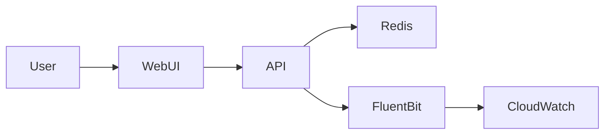
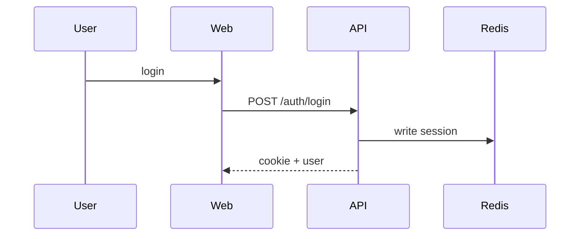

# Architecture

```mermaid
flowchart LR
  User-->WebUI
  WebUI-->API
  API-->Redis
  API-->FluentBit
  FluentBit-->CloudWatch
```

```mermaid
sequenceDiagram
  participant U as User
  participant W as Web
  participant A as API
  participant R as Redis
  U->>W: login
  W->>A: POST /auth/login
  A->>R: write session
  A-->>W: cookie + user
```
